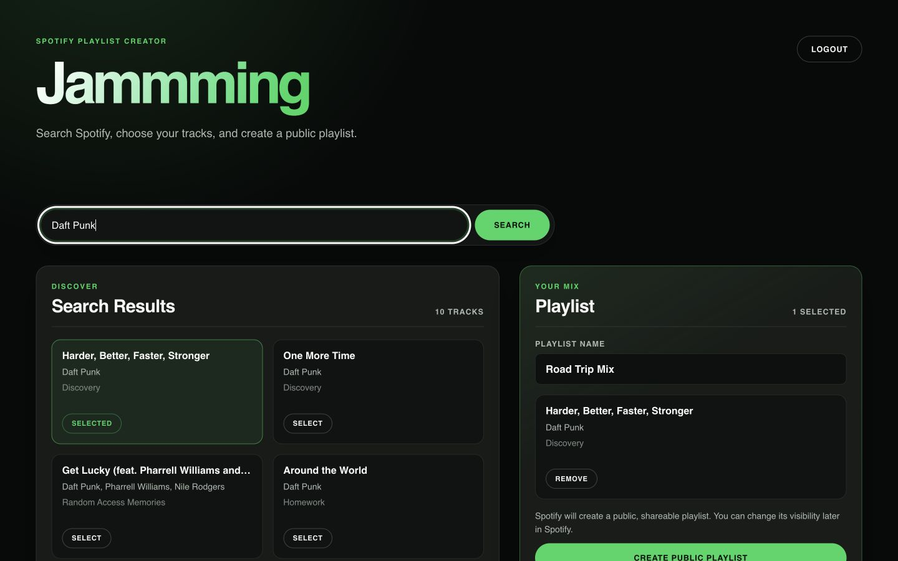
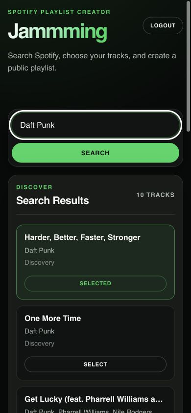

# Jammming — Spotify Playlist Creator

Jammming is a responsive React application for searching Spotify, collecting tracks, and saving them as a public, shareable playlist. It uses Spotify's Authorization Code flow with PKCE and the Spotify Web API endpoints introduced for Development Mode apps in 2026.

## Screenshots

### Desktop



### Mobile



## Features

- OAuth 2.0 Authorization Code flow with PKCE and `state` verification
- Access-token refresh on reload and a clear reauthorization path when a refresh token expires
- Spotify track search with the current 10-result API limit
- Duplicate-safe track selection across multiple searches
- Explicit public playlist creation through `POST /me/playlists`
- Ordered playlist item uploads through `POST /playlists/{id}/items`, batched in groups of 100
- Separate search and save progress, errors, and accessible status announcements
- Keyboard-friendly forms, visible focus styles, and responsive desktop/mobile layouts

## Prerequisites

- Node.js `20.19+` or `22.12+`
- npm
- A Spotify account
- A Spotify Developer application
- For Spotify Development Mode, an active Premium subscription for the app owner

Development Mode applications can only be used by users who have been added to the app's user allowlist. Spotify may also apply current Development Mode user and app limits.

## Local setup

1. Clone and install the project:

   ```bash
   git clone <repository-url>
   cd Spotify-API-Project
   npm install
   ```

2. In the [Spotify Developer Dashboard](https://developer.spotify.com/dashboard), add this exact redirect URI:

   ```text
   http://127.0.0.1:5173/callback
   ```

   Spotify permits HTTP for explicit loopback IP addresses during local development. Do not replace `127.0.0.1` with `localhost`, and make sure the configured URI matches exactly.

3. Copy the example environment file:

   ```bash
   cp .env.example .env
   ```

4. Set your public Spotify client ID in `.env`:

   ```dotenv
   VITE_SPOTIFY_CLIENT_ID=your_spotify_client_id
   VITE_SPOTIFY_REDIRECT_URI=http://127.0.0.1:5173/callback
   ```

   A Spotify client ID is a public OAuth identifier, not a client secret. Keeping it in environment configuration makes the project portable across developer apps and deployment URLs. Never add a Spotify client secret to this browser application.

5. Start the application:

   ```bash
   npm run dev
   ```

6. Open `http://127.0.0.1:5173`, authorize with an allowed Spotify account, and start building a playlist.

## Usage

1. Authorize Jammming with Spotify.
2. Search by track, artist, or album; Enter and the Search button both submit.
3. Select tracks from one or more searches.
4. Review the public-playlist notice, edit the playlist name, and choose **Create public playlist**.
5. Wait for confirmed success before leaving the page. If Spotify creates the playlist but cannot add every track, Jammming preserves the selection and warns you to inspect Spotify before retrying.

## Development commands

```bash
npm run dev        # Vite development server
npm test           # Run the automated test suite once
npm run test:watch # Run tests in watch mode
npm run lint       # ESLint
npm run build      # Production build
npm run preview    # Preview the production build
```

The Vitest and React Testing Library suite covers Spotify endpoint contracts, 100-item batching, save success and failure behavior, PKCE callback validation, startup refresh, `invalid_grant`, keyboard submission, and selected-track accessibility.

## Project structure

```text
src/
├── hooks/
│   ├── useAuth.js
│   └── useSpotify.js
├── utils/
│   ├── spotifyAuth.js
│   └── spotifyApi.js
├── Playlist/
├── SearchBar/
├── SearchResults/
├── Track/
├── Tracklist/
├── App.jsx
├── App.css
└── index.css
```

Tests live beside the source modules they cover, with shared setup in `src/test/`.

## Authentication and security notes

- Jammming is a browser-only application and uses PKCE, so it never requires or embeds a Spotify client secret.
- OAuth `state` and the short-lived PKCE verifier are kept in `sessionStorage` and consumed during the callback.
- Access and refresh tokens are persisted in `localStorage` for convenience across reloads. This storage is not protected from JavaScript running on the same origin, so an XSS vulnerability could expose those tokens.
- Spotify access tokens are refreshed shortly before expiry. Refresh tokens issued to Developer Dashboard apps expire six months after authorization; `invalid_grant` clears the session and asks the user to authorize again.
- The app retries an API request at most once after a 401 and does not loop on failed refreshes.
- Authorization sessions are versioned. A session created before a required scope change is cleared so the user can grant the current scopes instead of encountering a delayed save failure.

## 2026 Spotify Web API compatibility

This version uses:

- `POST /v1/me/playlists` instead of the removed `/users/{id}/playlists`
- `POST /v1/playlists/{id}/items` instead of the removed `/tracks` endpoint
- `user-read-private` for Search and `playlist-modify-public` for public playlist creation
- A maximum Search limit of 10, matching Spotify's current Development Mode API limit

See Spotify's [February 2026 migration guide](https://developer.spotify.com/documentation/web-api/tutorials/february-2026-migration-guide), [playlist concepts](https://developer.spotify.com/documentation/web-api/concepts/playlists), [refresh-token guidance](https://developer.spotify.com/documentation/web-api/tutorials/refreshing-tokens), and [redirect URI requirements](https://developer.spotify.com/documentation/web-api/concepts/redirect_uri).

## Known limitations

- Playlist creation and item insertion are separate Spotify requests. If item insertion fails, Spotify may retain an empty or partially populated playlist; the UI reports this rather than implying rollback.
- Spotify documents that a playlist's Web API `public` field is not an access-control guarantee, and playlist access cannot currently be changed through the Web API. Jammming therefore creates public/shareable playlists explicitly and discloses that behavior before saving. Change visibility or access later in a Spotify client if required.
- Tokens remain browser-managed in `localStorage`; a production application with stricter security requirements should consider a trusted backend.
- Search currently shows one page of 10 results.
- Spotify Development Mode availability depends on the app owner's Premium status and the app's allowed-user configuration.

## Technology

React 19, Vite 7, JavaScript, CSS, Spotify Web API, Vitest, and React Testing Library.

## License

This project is an educational portfolio project and uses the Spotify Web API under Spotify's applicable developer terms.
